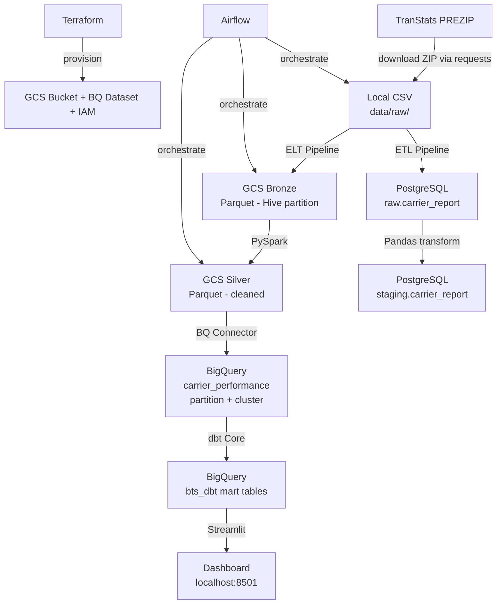
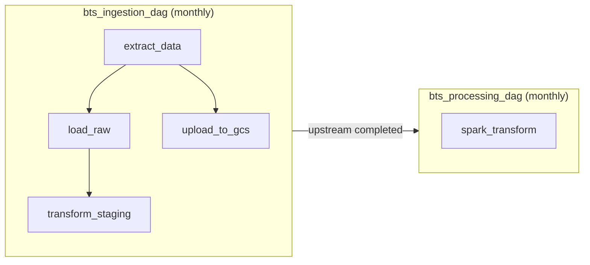
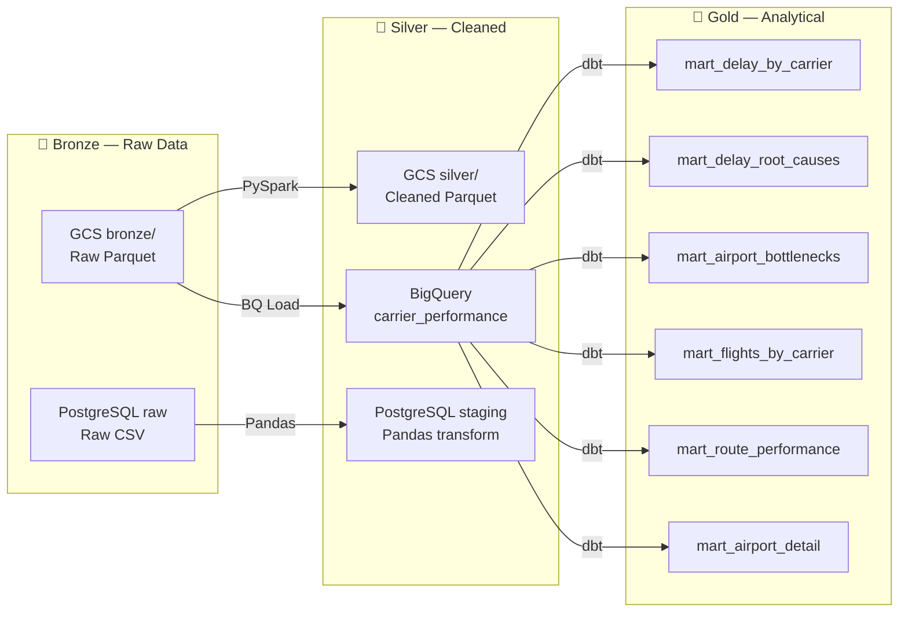

# BTS Airline On-Time Performance Pipeline


>Türkçe README dosyası: [docs/tr_README.md](docs/tr_README.md)

An end-to-end batch data pipeline that processes US domestic flight data and visualizes delay and cancellation patterns.

Millions of domestic flights take place in the US every year; however, making sense of delay, cancellation, and airport congestion patterns from raw data is difficult and costly. This project automatically downloads 20.9 million records from BTS/TranStats covering 2023–2025, processes them through a Bronze → Silver → Gold layered architecture, and presents business metrics through an interactive dashboard.


---

## 1. Project Objectives

- Automatically download and process 20.9 million flight records from 2023–2025
- Transform raw data through a Bronze → Silver → Gold layered architecture
- Build two parallel pipelines: ETL (PostgreSQL) and ELT (GCS + BigQuery)
- Enable monthly scheduling and backfill support with Airflow
- Build analytical mart tables on BigQuery using dbt Core
- Visualize delay, cancellation, and airport performance through a Streamlit dashboard
- Manage all infrastructure as code with Terraform
- Provide a reproducible environment that starts with a single command via Docker Compose

---

## 2. Data Source

**Bureau of Transportation Statistics (BTS) — TranStats**

- **Source:** Official statistics portal of the US Department of Transportation
- **Coverage:** All US domestic commercial flights from 1987 to present
- **This project:** 2023–2025 (36 months, ~20.9 million rows)
- **Record structure:** Each row represents one flight
- **Download method:** Automatic ZIP download via `requests` from `transtats.bts.gov/PREZIP/`

### Selected Columns (28 Columns)

28 meaningful columns were selected from over 100 available for the pipeline and analyses.

| Group | Columns |
|---|---|
| Time | Year, Month, DayOfWeek, FlightDate |
| Airline | Reporting_Airline |
| Departure | Origin, OriginCityName, CRSDepTime, DepTime, DepDelay, TaxiOut |
| Arrival | Dest, DestCityName, CRSArrTime, ArrTime, ArrDelay, TaxiIn |
| Cancellation / Diversion | Cancelled, CancellationCode, Diverted |
| Summary | ActualElapsedTime, AirTime, Distance |
| Delay Cause | CarrierDelay, WeatherDelay, NASDelay, SecurityDelay, LateAircraftDelay |

For column descriptions: [`docs/data_desc_eng.md`](docs/data_desc_eng.md)

### Lookup Tables

| File | Content |
|---|---|
| `L_UNIQUE_CARRIERS.csv` | Airline code → full name |
| `L_AIRPORT.csv` | Airport code → city, state |
| `L_CANCELLATION.csv` | Cancellation code → reason (A=Carrier, B=Weather, C=NAS, D=Security) |

### Data Links

- Main data page: https://transtats.bts.gov/DL_SelectFields.aspx?gnoyr_VQ=FGJ&QO_fu146_anzr=b0-gvzr
- Data ZIP page: https://transtats.bts.gov/PREZIP/

---

## 3. Tech Stack

| Layer | Technology | Purpose |
|---|---|---|
| Infrastructure | Terraform | GCS bucket, BigQuery dataset, IAM provisioning |
| Containerization | Docker + Docker Compose | Managing all services on a single network |
| Package Management | uv | Python dependency management, lock file |
| Orchestration | Apache Airflow 2.11 | DAG-based pipeline management, backfill |
| Data Storage | GCP Cloud Storage | Bronze and Silver Parquet files |
| Data Warehouse | GCP BigQuery | Analytical queries with partition + cluster |
| Batch Processing | Apache Spark 3.5 | GCS bronze → silver transformation |
| Transformation | dbt Core | BigQuery mart models and tests |
| Local Database | PostgreSQL | Local data lake for the ETL pipeline |
| DB Management | pgAdmin + pgcli | PostgreSQL visual and terminal management |
| Dashboard | Streamlit | Visualization over BigQuery mart tables |
| Visualization | Plotly | Interactive charts |
| Version Control | Git + GitHub | Code management |

---

## 4. Architecture

### Overall System Architecture



### Airflow DAG Flow



### Bronze / Silver / Gold Layer Architecture



---

## 5. Data Layers

| Layer | Location | Format | Description |
|---|---|---|---|
| **Bronze** | GCS `bronze/carrier_report/year=/month=/` | Parquet (Hive partition) | Raw data, untouched |
| **Bronze** | PostgreSQL `raw.carrier_report` | Table (TEXT columns) | Raw landing zone for ETL pipeline |
| **Silver** | GCS `silver/carrier_report/year=/month=/` | Parquet | Cleaned and type-cast via PySpark |
| **Silver** | PostgreSQL `staging.carrier_report` | Table | Pandas transform, ETL pipeline staging |
| **Silver** | BigQuery `bts_airline.carrier_performance` | Partitioned + Clustered table | `flight_date` partition, `reporting_airline` + `origin` cluster |
| **Gold** | BigQuery `bts_dbt.*` | Materialized table | 6 dbt mart models |

### BigQuery Optimization Decisions

- **Partition:** By `flight_date` column — dbt mart models scan only relevant partitions when querying specific date ranges, reducing cost and query time
- **Cluster:** `reporting_airline`, `origin` — reduces query cost on the most frequently filtered columns

---

## 6. dbt Mart Tables

6 analytical mart tables have been built on BigQuery using dbt Core. All models are defined as `materialized='table'` and the Streamlit dashboard is fed from these tables.

| Table | Granularity | Question Answered |
|---|---|---|
| `mart_delay_by_carrier` | Year + Month + Airline | Who delayed how much and when? What is the cancellation rate? |
| `mart_delay_root_causes` | Airline | Is the delay cause carrier, weather, or NAS? |
| `mart_airport_bottlenecks` | Airport | Which airport creates bottlenecks? What are the taxi times? |
| `mart_flights_by_carrier` | Airline | What is the total flight volume and diversion rate? |
| `mart_route_performance` | Origin + Dest | What are the busiest routes? Cancellation and delay rates? |
| `mart_airport_detail` | Airport | Airport metrics from departure and arrival perspectives |

dbt tests: `not_null`, `unique`, `accepted_values` — all models validated with `dbt test`.

---

## 7. Dashboard

The interactive dashboard built with Streamlit queries BigQuery mart tables directly. Query results are cached with `@st.cache_data(ttl=3600)`. The year filter at the top of the page (2023 / 2024 / 2025) dynamically updates the relevant tiles.

### KPI Cards (page header)

4 summary metrics covering all years:

- Total number of flights
- Overall delay rate (%)
- Overall cancellation rate (%)
- Worst performing airline (by average arrival delay)

### Tile 1 — Delay Root Cause Distribution *(categorical)*

**Source:** `mart_delay_root_causes`

Percentage distribution of delay causes by airline. Each bar represents an airline, colors represent delay causes: Carrier, Weather, NAS, Security, Late Aircraft. Airlines are sorted in descending order by total delayed flights.

### Tile 2 — Monthly Delay and Cancellation Trend *(temporal)*

**Source:** `mart_delay_by_carrier`

Trend of monthly delay rate and cancellation rate across the 12 months of the selected year. Two side-by-side line charts — separated to avoid misleading dual-axis display due to scale differences.

### Tile 3 — Airline Flight Volume and Diversion

**Source:** `mart_flights_by_carrier`

Total flight volume and diversion rate by airline. Two side-by-side bar charts; hovering shows the full airline name.

### Tile 4 — Top 10 Airport Performance

**Source:** `mart_airport_detail`

Top 10 airports by total traffic. Heat-colored table by `avg_arr_delay_mins` (red = poor performance) and a horizontal bar chart displayed side by side. Metrics shown: airport code, city, total traffic, average taxi-out, average arrival delay, dominant airline.

### Tile 5 — Route Performance Table

**Source:** `mart_route_performance`

Top 20 routes filtered by origin airport selection. Each route shows average air time, cancellation rate, average departure and arrival delay.

### Tile 6 — Airport Detail Scorecard

**Source:** `mart_airport_detail`

9 metrics presented as cards for the selected airport via selectbox: total departures, total arrivals, total traffic, average taxi-out, average taxi-in, average departure delay, average arrival delay, total diversions, dominant airline.

---

## 8. Project Structure

```text
bd_project/
├── analytics/                         # Analytics layer and dashboard code
│   ├── dbt/
│   │   └── bts_airline/               # dbt Core project
│   │       ├── dbt_project.yml        # dbt configuration, materialization settings
│   │       └── models/
│   │           ├── staging/           # stg_carrier_report (VIEW)
│   │           └── mart/              # 6 analytical mart tables (TABLE)
│   └── streamlit/
│       └── app.py                     # Streamlit dashboard
├── data/
│   ├── lookups/                       # Airline, airport, cancellation code lookup CSVs
│   ├── raw/                           # Downloaded raw CSVs — gitignored
│   └── sample/                        # Sample data for EDA
├── docker/
│   ├── airflow/
│   │   └── Dockerfile                 # Airflow custom image (google provider included)
│   ├── spark/
│   │   └── Dockerfile                 # Spark image (GCS + BQ connector JARs included)
│   ├── streamlit/
│   │   └── Dockerfile                 # Streamlit container
│   └── docker-compose.yaml            # All services on one network: airflow, postgres, pgadmin, spark, streamlit
├── docs/
│   ├── doc_images/                    # Screenshots for README
│   │   └── image.png
│   ├── data_desc_eng.md               # English descriptions of 28 columns
│   ├── data_desc_tr.md                # Turkish descriptions of 28 columns
│   └── tr_README.md                   # Turkish README
├── infra/
│   ├── keys/                          # GCP service account JSON key — gitignored
│   ├── main.tf                        # GCS bucket, BigQuery dataset, IAM resources
│   ├── variables.tf                   # Terraform variable definitions
│   ├── outputs.tf                     # Outputs after apply
│   ├── terraform.tfvars               # Variable values (gitignored)
│   └── terraform.tfvars.example       # Variable template
├── ingestion/
│   ├── config.py                      # Shared constants: URL template, column list, DB config
│   ├── utils.py                       # get_connection(), get_logger() helpers
│   ├── dags/
│   │   ├── bts_ingestion_dag.py       # ETL + ELT orchestration DAG (monthly, backfill)
│   │   └── bts_processing_dag.py      # Spark processing DAG
│   ├── etl/
│   │   ├── extract.py                 # TranStats PREZIP → local CSV
│   │   ├── load_raw.py                # CSV → PostgreSQL raw.carrier_report
│   │   └── transform_load_staging.py  # raw → staging.carrier_report (Pandas)
│   ├── elt/
│   │   └── upload_to_gcs.py           # CSV → GCS bronze (Parquet, Hive partition)
│   └── notebooks/
│       └── EDA_1.ipynb                # Exploratory data analysis
├── processing/
│   ├── config.py                      # Spark + GCS + BigQuery constants
│   ├── spark_transform.py             # GCS bronze → silver + BigQuery load
│   └── utils.py                       # Spark helper functions
├── .env.example                       # Environment variable template — copy and fill as .env
├── .gitignore
├── pyproject.toml                     # Python dependency management with uv
├── uv.lock                            # Locked dependency tree
├── ROADMAP.md                         # Phase-based development roadmap
└── README.md
```

---

## 9. Quick Start

### Requirements

- Docker and Docker Compose
- Python 3.11+ and [uv](https://docs.astral.sh/uv/)
- GCP account (service account + JSON key)
- Terraform

### Setup Steps

```bash
# 1. Clone the repo
git clone <repo-url>
cd bd_project

# 2. Set up Python environment
uv sync

# 3. Install dbt (isolated environment — prevents dependency conflicts)
uv tool install dbt-core --with dbt-bigquery

# 4. Configure environment variables
cp .env.example .env
# Edit .env:
# POSTGRES_USER, POSTGRES_PASSWORD, POSTGRES_DB
# PGADMIN_DEFAULT_EMAIL, PGADMIN_DEFAULT_PASSWORD
# AIRFLOW_UID (Linux: get with id -u command)
# AIRFLOW__CORE__FERNET_KEY
# AIRFLOW__DATABASE__SQL_ALCHEMY_CONN
# GCP_PROJECT_ID, GCS_BUCKET_NAME, BQ_DATASET
# GOOGLE_APPLICATION_CREDENTIALS=/app/keys/gcp-key.json

# 5. Place GCP service account JSON key
mkdir -p infra/keys
cp /path/to/your/gcp-key.json infra/keys/gcp-key.json

# 6. Provision GCP infrastructure with Terraform
cd infra
cp terraform.tfvars.example terraform.tfvars
# Edit terraform.tfvars
terraform init
terraform apply
cd ..

# 7. Start Docker services
docker compose -f docker/docker-compose.yaml up -d --build

# 8. Create PostgreSQL schemas (once, on first setup)
pgcli -h localhost -p 5432 -U <POSTGRES_USER> -d <POSTGRES_DB>
# Inside pgcli:
# CREATE SCHEMA raw;
# CREATE SCHEMA staging;

# 9. Start pipeline from Airflow UI
# http://localhost:8080 → admin / admin
# bts_ingestion_dag → Enable → Backfill (2023-01-01 → 2025-12-01)
# bts_processing_dag → Enable → Backfill

# 10. Build dbt mart models
cd analytics/dbt/bts_airline
dbt run
dbt test
cd ../../..

# 11. Access the dashboard
# http://localhost:8501
```

### Service Addresses

| Service | Address | Credentials |
|---|---|---|
| Airflow UI | http://localhost:8080 | admin / admin |
| pgAdmin | http://localhost:5050 | values from .env |
| Streamlit | http://localhost:8501 | — |
| Spark UI | http://localhost:4040 | — (while job is running) |

### Notes

- `data/raw/` and `infra/keys/` are in `.gitignore` — not included in the repo
- The `airflow-init` service prepares the DB on first run and stops — this is expected behavior
- Backfill triggers ~36 Airflow runs, which may take some time to complete
- Spark jobs use all CPU cores in `local[*]` mode

---

## 10. Phase-Based Development

The project was developed in 6 phases:

| Phase | Scope |
|---|---|
| PHASE 0 | Repo, folder structure, uv environment, .env template |
| PHASE 1 | GCP infrastructure with Terraform (GCS, BigQuery, IAM) |
| PHASE 2 | Docker setup, ETL + ELT pipeline scripts, Airflow DAG |
| PHASE 3 | GCS bronze → silver transformation with PySpark, BigQuery load |
| PHASE 4 | dbt Core mart models and tests |
| PHASE 5 | Streamlit dashboard, Docker integration |

> Detailed phase-by-phase development documentation (prepared in Turkish during development): [docs/project_phases.md](docs/project_phases.md)

---

## 11. Branch Strategy

- `main`: Stable, completed phases
- `dev`: Active development
- Phase-based commits with prefixes: `feat:`, `chore:`, `fix:`, `docs:`
- Example: `feat: add pyspark transformation pipeline from GCS bronze to silver`

---

## 12. Known Issues

| Issue | Solution |
|---|---|
| WSL2 + ADC credential conflict — `authorized_user` type was falling through to metadata server | Replaced with service account JSON key |
| Docker volume interpolation — `${VAR}` in compose was resolved before `env_file` | Volume paths hardcoded |
| Spark BigQuery connector — `curl` without redirect following downloaded 0-byte JAR | Fixed with `curl -fL` |
| dbt dependency hell — main environment and `dbt-bigquery` versions conflicted | Isolated environment created with `uv tool install` |
| Airflow → Docker socket — `docker-ce-cli` required to call `docker run` from container | Added to Airflow Dockerfile, socket mount configured |

> Detailed error documentation and resolution steps will be added in the future.

---

## 13. Future Work

- [ ] CI/CD pipeline — automated dbt test + Terraform plan with GitHub Actions
- [ ] Map tile — geographic visualization by airport in Streamlit
- [ ] Slowly Changing Dimension support with dbt snapshots
- [ ] Data quality checks with Great Expectations
- [ ] Single-command setup with Makefile
- [ ] Unit tests — for Airflow DAGs and Spark transform
- [ ] Migration to production-grade Spark cluster with GCP Dataproc


---

## 14. License

MIT License — see the `LICENSE` file for details.