# Proje Faz Dokümantasyonu

BTS Airline On-Time Performance Pipeline — Faz bazlı geliştirme süreci.

---

## FAZ 0: Hazırlık & Ortam Kurulumu

1. GitHub reposu oluşturuldu.
   - `main` ve `dev` branch'leri push'landı. Geliştirmeler `dev` branch'inde yapılıp son kontroller sonrası `main` ile merge ediliyor ve her geliştirme sonrası push'lanıyor. Profesyonel bir çalışma amaçlandı.

2. Proje klasör yapısı oluşturuldu:
   - `ingestion/`: Data ingest işlemleri burada yapılıyor. Local database ve cloud'ta bronze katmanı oluşturuluyor.
   - `processing/`: Silver katmanı burada. PySpark ile bronze ham veriler işleniyor.
   - `analytics/`: dbt ile analitik çalışmaların yürütüldüğü bölüm. Gold katmanı burada.
   - `infra/`: Terraform gibi işler burada yürütülüyor. Cloud mimarisi burada oluşturuluyor.
   - `docker/`: Docker dosyaları burada.

3. Paket yöneticisi olarak hızlılığı, kullanım kolaylığı ve mimarisi nedeniyle `uv` seçildi. `uv init` ile oluşturuldu.

4. `.env.example` dosyası oluşturuldu. Repoyu kullanacak geliştiriciler için ortam değişkenleri (PostgreSQL ve cloud) burada şablon olarak sunuluyor.

5. GCP projesi oluşturuldu. Servis hesabı ve JSON key locale indirildi.

---

## FAZ 1: IaC — Cloud Altyapı (Terraform)

1. Terraform proje yapısı kuruldu:

   - **`main.tf`** — Kaynaklar burada tanımlandı:
     - `google_storage_bucket` — GCS bucket, yani data lake'imiz. Ham uçuş verileri (CSV/Parquet) buraya iniyor. Bronze ve silver katmanları bu bucket altında klasörler olarak yaşıyor. Versioning açık, 90 günden eski bronze dosyalar otomatik siliniyor.
     - `google_bigquery_dataset` — Analitik veritabanımız. PySpark dönüşümlerinden geçmiş temiz veri buraya yükleniyor, dbt mart modelleri buradan sorgu çalıştırıyor, Streamlit dashboard buradan besleniyor.
     - `google_project_iam_member` (x3) — Servis hesabına 3 rol bağlandı:
       - `storage.admin` → GCS'e okuma/yazma
       - `bigquery.admin` → BigQuery'de tablo oluşturma/sorgulama
       - `bigquery.jobUser` → BigQuery job çalıştırma (sorgu, yükleme vb.)

   - **`variables.tf`** — Gerekli değişkenler; açıklamaları ve type'ları ile birlikte burada tanımlandı.

   - **`terraform.tfvars`** — `variables.tf`'de tanımlanan değişken değerleri burada. Güvenlik amacıyla `.gitignore`'a eklendi.

   - **`terraform.tfvars.example`** — Repoyu kullanacak geliştiriciler için ignore edilen `.tfvars` dosyasının şablon kopyası.

   - **`outputs.tf`** *(opsiyonel)* — `terraform apply` sonrası bucket name ve BigQuery dataset id değerleri bilgilendirme amaçlı terminale yazdırılır.

---

## FAZ 2: Data Ingestion Pipeline

### Part 1: Docker Altyapısı

1. `docker/airflow/Dockerfile` yazıldı. `apache/airflow:2.11.2` base image kullanıldı. Pandas, PyArrow ve Airflow'un Google provider'ı image'a gömüldü. Bu sayede container ayağa kalktığında tekrar kurulum yapılması önlendi. `airflow` user ile çalışıldı — root pip kurulumunu engellediğinden bu kullanıcıya geçildi.

2. `.env` içi (PostgreSQL, pgAdmin, Airflow) dolduruldu.

3. `docker-compose.yaml` dosyası yazıldı — `postgres`, `pgadmin`, `airflow-init`, `airflow-webserver`, `airflow-scheduler` servisleri kuruldu ve ayağa kaldırıldı. Tüm servisler `pipeline-net` network'ünü kullanıyor.

4. `bts_airline` veritabanında `raw` ve `staging` şemaları oluşturuldu:
   - **`raw` şeması** — Verinin kaynaktan geldiği haliyle, hiç dokunulmadan saklandığı yer. TranStats'tan indirilen CSV'ler olduğu gibi buraya yükleniyor. Sütun isimleri orijinal, veri tipleri geniş (`TEXT`), hiçbir dönüşüm yok. Bir hata olursa veya transform yanlış giderse buradan tekrar başlanabiliyor. Ham veri her zaman güvende.
   - **`staging` şeması** — `raw`'dan alınan verinin temizlenip dönüştürüldüğü yer. Tip dönüşümleri (`TEXT` → `DATE`, `INTEGER`), null temizliği, sütun yeniden adlandırma burada yapılıyor.

   Büyük resim: `TranStats CSV → raw.carrier_report (ham) → staging.carrier_report (temiz) → dbt mart tabloları → Streamlit`

---

### Part 2: ETL Pipeline

`TranStats → local CSV → Pandas transform → PostgreSQL`

```
ingestion/
├── config.py        ← ortak sabitler
├── utils.py         ← ortak yardımcılar (DB bağlantısı, logging, .env)
├── dags/
├── etl/
│   ├── extract.py
│   ├── load_raw.py
│   └── transform_load_staging.py
└── elt/
```

1. `ingestion/config.py` yazıldı. ETL ve ELT pipeline'ları için ortak yapılar: path'ler, URL'ler, seçilen kolonlar, lookup dosyaları, DB config ayarları, şema ve tablo adları burada tanımlı.

2. Lookup dosyaları otomatik indirilebilecek bir yapı olmadığından manuel indirilerek `data/lookups/` dizinine yerleştirildi.

3. `ingestion/etl/extract.py` yazıldı:
   - Terminalden yıl ve ay argümanı alıyor
   - PREZIP URL oluşturup `requests` ile ZIP indiriyor
   - ZIP'i açıp `selected_columns`'ları filtreliyor
   - `data/raw/YYYY/YYYY_MM.csv` olarak kaydediyor
   - ZIP dosyasını siliyor

4. `ingestion/utils.py` yazıldı. İki fonksiyon tanımlandı:
   - `get_connection()`: `config.py`'daki DB config ayarlarını kullanarak `psycopg2` ile DB'ye bağlanır.
   - `get_logger()`: `logging` kütüphanesi ile tüm log mesajlarını kategorileştirir.

5. `ingestion/etl/load_raw.py` yazıldı. Filtrelenmiş ham CSV verilerini PostgreSQL `raw.carrier_report` tablosuna yükler:
   - Dinamik çalışır — aldığı yıl ve ay bilgilerine göre `csv_path` oluşturur
   - `get_connection()` ile cursor açarak şema ve tabloyu oluşturur (yoksa), kolonları `TEXT` tipinde tanımlar
   - Aynı tarihe ait veri varsa siler (idempotent)
   - `execute_batch` ile bulk insert yapar

6. `ingestion/etl/transform_load_staging.py` ve `ingestion/notebooks/EDA_1.ipynb` yazıldı. `raw.carrier_report`'tan okunan veriye dönüşüm uygulanarak `staging.carrier_report`'a yükleniyor:
   - EDA sonuçlarına göre kolon tipleri belirlendi (`float_columns`, `bool_columns`)
   - `delay_category()`: `ArrDelay` kullanılarak gecikme seviyesi kategorileştirildi
   - `transform()`: Raw verilere tüm dönüşümler uygulandı
   - `build_col_defs()`: Kolonların PostgreSQL veri tipleri belirlendi
   - `transform_load_staging()`: Yukarıdaki fonksiyonlar kullanılarak veriler staging şemasına yüklendi

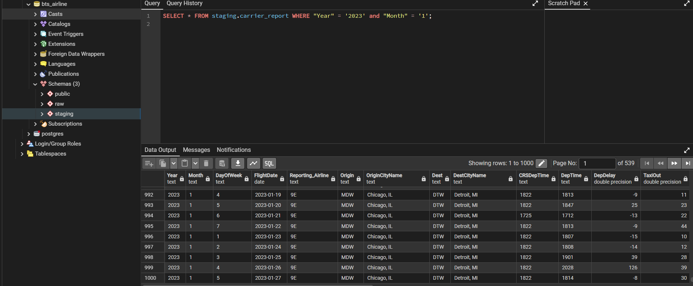

---

### Part 3: ELT Pipeline

`local CSV → GCS bronze (Parquet, Hive partition)`

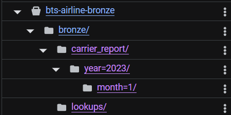

1. `.env`'e `BUCKET_NAME` ve `CREDENTIALS_JSON_PATH` eklendi.

2. `config.py`'a GCS sabitleri eklendi.

3. `ingestion/elt/upload_to_gcs.py` yazıldı:
   - `get_gcs_client()`: GCP key config ile Storage client oluşturur.
   - `upload_parquet(year, month)`: Aldığı yıl ve ay bilgisine göre local CSV'yi Parquet'e çevirip bucket'a yükler. Yükleme formatı Hive formatıdır: `{GCS_BRONZE_PREFIX}/year={year}/month={month}/data.parquet`. Parquet dosyaları geçici olarak `tempfile`'da oluşturulur — disk dolması problemi yaşanmaz. Yükleme sonrası local dosya silinir.
   - `upload_lookups()`: `data/lookups/` dizinindeki dosyaları bucket'ın `bronze/lookups/` dizinine yükler.

---

### Part 4: Airflow DAG — ETL & ELT Orchestration

1. Script'lerdeki fonksiyonlar `click` decorator'ü ile tanımlandığından Airflow tarafından doğrudan çağrılamıyordu. Ana iş mantığı `run()` fonksiyonuna taşındı, `click` decorator'lü fonksiyonlar `run()`'ı çağıracak şekilde güncellendi.

2. `ingestion/dags/bts_ingestion_dag.py` yazıldı:

   | Task | Çağırdığı Fonksiyon |
   |---|---|
   | `extract_data` | `extract.run(year, month)` |
   | `load_raw` | `load_raw.run(year, month)` |
   | `transform_load_staging` | `transform_load_staging.run(year, month)` |
   | `upload_to_gcs` | `upload_to_gcs.run(year, month)` |

   DAG parametreleri:
   ```python
   with DAG(
       dag_id="bts_ingestion_dag",
       start_date=datetime(2023, 1, 1),   # veri çekme başlangıç tarihi
       schedule_interval="@monthly",       # her ay başında tetiklenir
       catchup=True,                       # geçmiş ayları sırayla işler
       max_active_runs=1,                  # aynı anda sadece bir run
       default_args={"retries": 1},        # hata durumunda bir kez daha dene
   )
   ```

   Task bağımlılıkları — ETL ve ELT kolları extract'tan sonra paralel çalışır:
   ```
   extract_data >> [load_raw, upload_to_gcs]
   load_raw >> transform_staging
   ```

   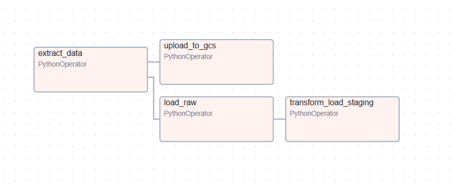

3. Testler ve karşılaşılan sorunlar:

   ```bash
   docker compose -f docker/docker-compose.yaml exec airflow-webserver \
     airflow tasks test bts_ingestion_dag upload_to_gcs 2024-03-01
   ```

   | Sorun | Kök Neden | Çözüm |
   |---|---|---|
   | `ModuleNotFoundError: etl` | Sadece `dags/` mount edilmişti, `ingestion/` tamamı değil | Her iki Airflow servisine `../ingestion:/opt/airflow/ingestion` mount eklendi |
   | `PermissionError` (extract_data) | `data/` klasörü container'a mount edilmemişti | `../data:/opt/airflow/data` mount eklendi, `chmod -R 777 data/` uygulandı |
   | `psycopg2 Connection Refused` (load_raw) | `config.py` default olarak `localhost` kullanıyordu, container içinden erişilemiyor | `.env`'e `POSTGRES_HOST=postgres` eklendi, container `--force-recreate` ile yeniden başlatıldı |
   | `FileNotFoundError` (upload_to_gcs) | `.env`'deki relative path container içinde geçersiz | `GCS_KEY_PATH` container içi absolute path olarak güncellendi |

4. Testler başarılı olduktan sonra DAG run moduna alındı.

   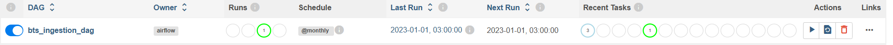

5. DAG run durumundayken task'lar başarıyla çalıştırıldı. 2026 verileri henüz kaynakta olmadığından son birkaç task hata verdi — beklenen davranış.

   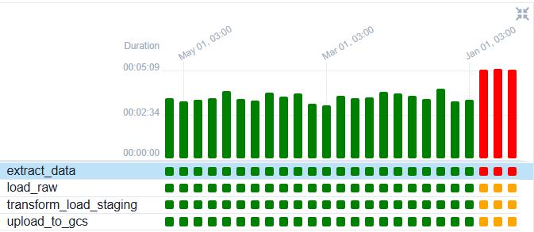

   GCS'te Hive formatında veriler:

   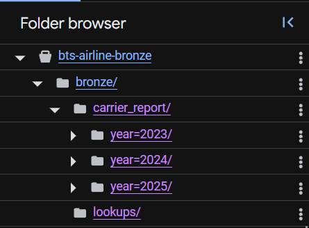
   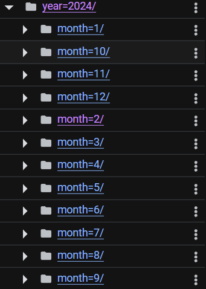

   Local raw dosyalar:

   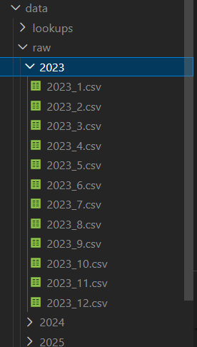

   GCS raw şeması:

   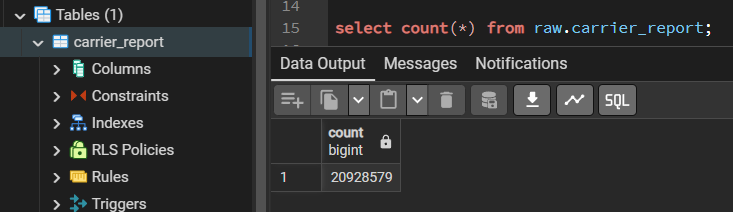

#### Bilinen Sorun — Airflow Task Log 403 / NameResolutionError

**Sorun:** Webserver, scheduler container'ına hostname üzerinden HTTP bağlanamıyor. Eski run'ların logları UI'da görünmüyor.

**Kök neden:** Scheduler logları kendi container'ında üretiyor, webserver container ID'sini hostname olarak çözmeye çalışıyor fakat başarısız oluyor.

**Denenen çözümler:**
- `AIRFLOW__WEBSERVER__SECRET_KEY` sabitlendi
- `hostname` docker-compose'a eklendi
- Shared `airflow-logs` volume eklendi

**Kalıcı çözüm için bakılacaklar:**
- `AIRFLOW__LOGGING__REMOTE_LOGGING=True` + GCS bucket konfigürasyonu ile uzak log yazma

**Not:** Yeni çalıştırılan task'larda shared volume sayesinde sorun çözülmüş olabilir — eski run'lar için loglar kayıp.

---

## FAZ 3: ELT Processing — GCS Bronze → Silver → BigQuery

GCS bronze katmanındaki ham Parquet dosyaları PySpark ile temizlenip dönüştürülerek silver katmanına yazıldı ve BigQuery'e yüklendi. 2023–2025 arası 36 aylık veri, toplam **20,9 milyon kayıt** olarak BigQuery'de hazır hale getirildi.

### Part 1: Altyapı

1. `docker/spark/Dockerfile` yazıldı:
   - Resmi `apache/spark` image'ı kullanıldı (`bitnami/spark` Docker Hub'da bulunamadığından bu image'a geçildi)
   - GCS connector (`hadoop3-2.2.26`) ve BigQuery connector (`0.44.1`) Maven Central'dan `curl -fL` ile indirildi
   - Servis hesabı credentials ve `processing/` klasörü image'a bake edildi

2. `.dockerignore` ile build context'ten `.git`, `venv`, `*.parquet` dışlandı — build context 1.7GB'ı aşıyordu.

3. `docker/docker-compose.yaml`'a `spark` servisi eklendi. GCP key dizin olarak mount edildi. Airflow servislerine `/var/run/docker.sock` mount'u eklendi.

4. `docker/airflow/Dockerfile` Spark için güncellendi — `docker-ce-cli` önce Ubuntu repo'sundan (`docker.io`) kuruldu, versiyon uyumsuzluğu (v20 → v29) nedeniyle Docker'ın resmi Debian repo'sundan kurulacak şekilde yeniden düzenlendi.

### Part 2: Spark Processing

1. `processing/config.py` yazıldı: GCP, GCS, BigQuery sabitleri, lookup sabitleri ve kolon sabitleri tanımlandı.

2. `processing/utils.py` yazıldı: `get_logger()` fonksiyonu tanımlandı.

3. `processing/spark_transform.py` yazıldı:
   - GCS ve BQ config'li SparkSession oluşturuldu
   - Bronze katman okundu
   - Tip dönüşümleri yapıldı
   - Null değerler dolduruldu
   - Lookup join'leri yapıldı (airline adı, şehir-eyalet, iptal nedeni)
   - Türetilmiş kolonlar eklendi (`is_delayed`, `delay_category`)
   - Kolon adları BigQuery formatına uygun snake_case'e dönüştürüldü
   - GCS silver'a Parquet yazıldı, BigQuery'e yüklendi
   - Write modu `overwrite`'tan `append`'e alındı (ilk DAG çalıştırmada overwrite nedeniyle 2023 ve 2024 yılları yazılamamıştı)
   - Local test: 2023 Ocak verisi `spark-submit` ile başarıyla işlendi

4. `ingestion/dags/bts_processing_dag.py` yazıldı:
   - `BashOperator` yerine `PythonOperator` + `subprocess.run` kullanıldı — Spark log'ları bu sayede Airflow UI'da görünür hale geldi

5. Backfill: 36 aylık Spark job çalıştırmak yerine GCS silver katmanındaki tüm partition'lar BigQuery Native Load ile tek sorguda yüklendi.

   GCS silver:
   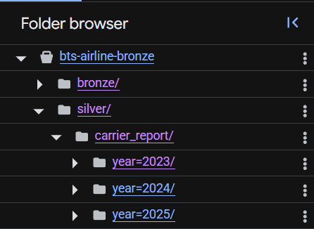

   BigQuery dataset:
   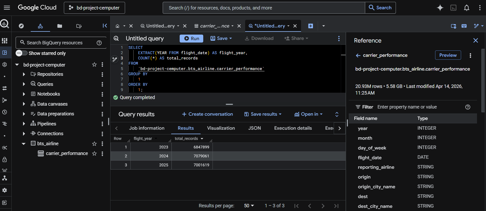

### Karşılaşılan Sorunlar

| Sorun | Çözüm |
|---|---|
| `bitnami/spark` image bulunamadı | Resmi `apache/spark` image'ına geçildi |
| `USER_CREDENTIALS` WSL2'de metadata server'a düşüyor | `SERVICE_ACCOUNT_JSON_KEYFILE` + servis hesabına geçildi |
| WSL2 bind mount çalışmıyor | `processing/` ve credentials image'a bake edildi |
| `docker-ce-cli` versiyon uyumsuzluğu (v20 vs v29) | Docker resmi Debian repo'sundan kurulum |
| BigQuery partition çakışması | Mevcut partition'sız tablo silindi, connector yeniden oluşturdu |
| Build context 1.7GB'ı aşıyor | `.dockerignore` eklendi |

---

## FAZ 4: Analytics Layer — Gold (dbt)

1. **dbt Core kurulumu:**

   Ana ortamdaki paket sürümleri (`google-api-core`, `google-cloud-core`, `packaging`) ile `dbt-bigquery`'nin talep ettiği sürümler çakıştı — klasik "Dependency Hell" sorunu. Çözüm olarak `uv tool install` ile izole ortam kuruldu:

   ```bash
   uv tool install dbt-core --with dbt-bigquery --force
   ```

2. `analytics/dbt/` dizininde `dbt init bts_airline` ile dbt projesi oluşturuldu:
   - Adapter: BigQuery
   - Dataset: `bts_dbt`
   - Threads: 4, Timeout: 300
   - Location: EU
   - `dbt debug` ile bağlantı doğrulandı: `All checks passed!`

3. **Staging katmanı:**

   `models/staging/sources.yml` — data kaynak haritası:
   ```yaml
   version: 2
   sources:
     - name: bts_raw
       database: "{{ env_var('GCP_PROJECT_ID') }}"
       schema: bts_airline
       tables:
         - name: carrier_performance
           description: "20.9M rows cleaned flight data"
   ```

   `models/staging/stg_carrier_report.sql` — `VIEW` olarak materialized (depolama maliyeti sıfır). Staging katmanında iş mantığı uygulanmadı; sadece downstream modellerinde kullanılacak kolonlar seçildi ve isimlendirme standartları sağlandı. `flight_year` ve `flight_month` kolonları `EXTRACT` ile türetildi.

   `models/staging/schema.yml` — Anahtar kolon açıklamaları ve null testleri tanımlandı. `dbt test --select stg_carrier_report` ile doğrulandı.

4. **Mart katmanı:**

   Tüm mart modelleri `materialized='table'` — Streamlit'in hızlı okuması için. `models/mart/schema.yml`'da her tablo ve kolon için İngilizce açıklama ve testler yazıldı.

   | Model | Granularity | Temel Metrikler |
   |---|---|---|
   | `mart_delay_by_carrier` | Yıl + Ay + Havayolu | Uçuş hacmi, iptal oranı, gecikme kategorileri, diversion |
   | `mart_delay_root_causes` | Havayolu | Gecikme kök neden yüzdeleri |
   | `mart_airport_bottlenecks` | Havalimanı | Taxi süreleri, trafik hacmi, kalkış/varış gecikmesi |
   | `mart_flights_by_carrier` | Havayolu | Toplam uçuş, diversion oranı, airline_name |
   | `mart_route_performance` | Origin + Dest | Rota bazlı hacim, air time, iptal oranı |
   | `mart_airport_detail` | Havalimanı | Kalkış + varış perspektifi, dominant havayolu |

---

## FAZ 5: Streamlit Dashboard

1. **Bağımlılıklar** `uv add` ile eklendi: `streamlit`, `plotly`, `google-cloud-bigquery`, `google-cloud-bigquery-storage`, `pyarrow`, `db-dtypes`, `python-dotenv`

2. **`analytics/streamlit/app.py`** yazıldı:
   - BigQuery'e `service_account.Credentials` ile açık bağlantı kuruldu
   - Her mart tablosu için `@st.cache_data(ttl=3600)` ile önbellekli veri yükleme fonksiyonları tanımlandı
   - Sayfa başında `st.segmented_control` ile 2023 / 2024 / 2025 yıl filtresi — KPI kartlarını ve aylık trend grafiklerini etkiliyor

   Dashboard bileşenleri:

   | Bileşen | Kaynak Mart | Açıklama |
   |---|---|---|
   | KPI Kartları | `mart_delay_by_carrier` | Toplam uçuş, gecikme oranı, iptal oranı, en kötü havayolu |
   | Gecikme Kök Nedeni | `mart_delay_root_causes` | Havayolu bazında stacked bar chart |
   | Aylık Trend | `mart_delay_by_carrier` | Yan yana iki line chart — gecikme ve iptal oranı |
   | Uçuş Hacmi | `mart_flights_by_carrier` | Havayolu bazında bar chart, diversion oranı |
   | Rota Performansı | `mart_route_performance` | Origin seçimine göre filtrelenmiş top 20 rota tablosu |
   | Havalimanı Detayı | `mart_airport_detail` | Selectbox ile seçilen havalimanına ait 9 metrik kart |
   | Top 10 Havalimanı | `mart_airport_bottlenecks` | Isı renkli tablo + yatay bar chart |

3. **`docker/streamlit/Dockerfile`** — `python:3.11-slim` base, `uv` ile bağımlılık kurulumu, `EXPOSE 8501`, `--server.address=0.0.0.0`

4. **`docker/docker-compose.yaml`** — `streamlit` servisi eklendi. Build context proje kökü olarak ayarlandı. `../infra/keys:/app/keys` dizin mount ile GCP key erişimi sağlandı.

### Karşılaşılan Sorunlar

| Sorun | Çözüm |
|---|---|
| `GOOGLE_APPLICATION_CREDENTIALS` Airflow path'ini gösteriyordu | `.env`'de `/app/keys/gcp-key.json` olarak güncellendi |
| `--force-recreate` değişiklikleri yansıtmıyor | `build` + `--force-recreate` birlikte kullanılması gerektiği öğrenildi |
| IST / ESB havalimanları bulunamıyor | BTS verisi yalnızca ABD iç hat uçuşlarını kapsıyor, uyarı notu eklendi |