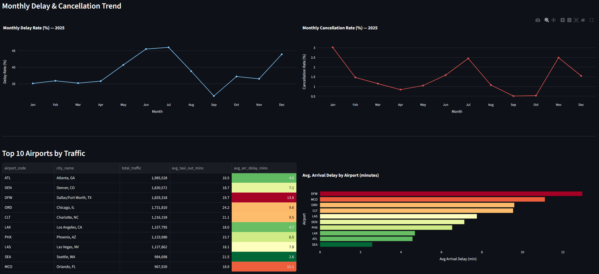
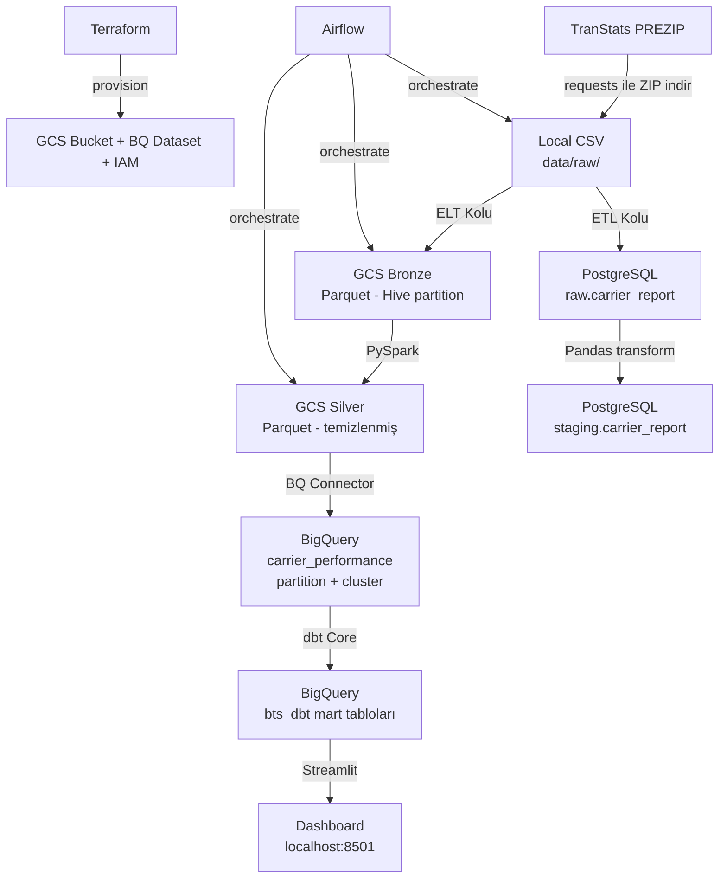
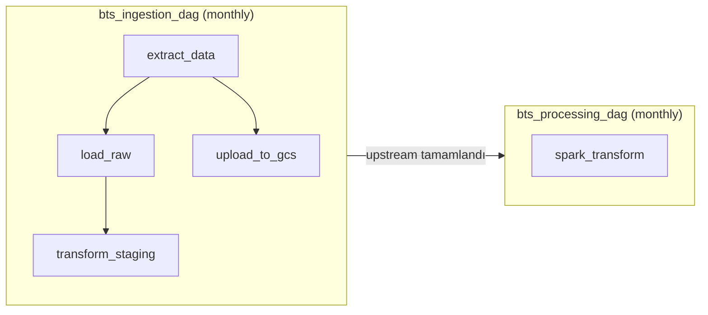
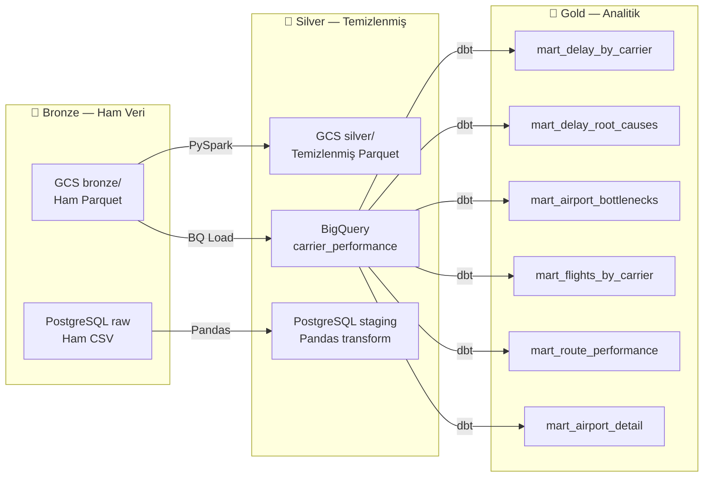

# BTS Airline On-Time Performance Pipeline


Türkçe README dosyası: [docs/tr_README.md](docs/tr_README.md)

ABD iç hat uçuş verilerini uçtan uca işleyen, gecikme ve iptal örüntülerini görselleştiren batch data pipeline.

ABD'de her yıl milyonlarca iç hat uçuşu gerçekleşiyor; ancak gecikme, iptal ve havalimanı yoğunluk desenlerini ham veri içinden anlamlı hale getirmek zor ve maliyetlidir. Bu proje, BTS/TranStats kaynağından 2023–2025 dönemine ait 20,9 milyon kayıtlık veriyi otomatik indirir, Bronze → Silver → Gold katman mimarisinde işler ve iş metriklerini interaktif bir dashboard ile sunar.




---

## 1. Proje Amacı

- 2023–2025 yılları arasında 20,9 milyon uçuş kaydını otomatik olarak indirmek ve işlemek
- Ham veriyi Bronze → Silver → Gold katman mimarisinde dönüştürmek
- ETL (PostgreSQL) ve ELT (GCS + BigQuery) olmak üzere iki paralel pipeline kurmak
- Airflow ile aylık schedule ve backfill desteği sağlamak
- dbt Core ile BigQuery üzerinde analitik mart tabloları oluşturmak
- Streamlit dashboard ile gecikme, iptal ve havalimanı performansını görselleştirmek
- Tüm altyapıyı Terraform ile Infrastructure as Code olarak yönetmek
- Docker Compose ile tek komutla ayağa kalkan reproducible ortam sağlamak

---

## 2. Veri Kaynağı

**Bureau of Transportation Statistics (BTS) — TranStats**

- **Kaynak:** ABD Ulaştırma Bakanlığı resmi istatistik portalı
- **Kapsam:** 1987'den günümüze tüm ABD iç hat ticari uçuşları
- **Bu projede:** 2023–2025 (36 ay, ~20,9 milyon satır)
- **Kayıt yapısı:** Her satır bir uçuşu temsil eder
- **İndirme yöntemi:** `transtats.bts.gov/PREZIP/` adresinden otomatik `requests` ile ZIP indirme

### Seçilen Kolonlar (28 Kolon)

100'den fazla kolon arasından pipeline ve analizler için anlamlı olan 28 kolon seçilmiştir.

| Grup | Kolonlar |
|---|---|
| Zaman | Year, Month, DayOfWeek, FlightDate |
| Havayolu | Reporting_Airline |
| Kalkış | Origin, OriginCityName, CRSDepTime, DepTime, DepDelay, TaxiOut |
| Varış | Dest, DestCityName, CRSArrTime, ArrTime, ArrDelay, TaxiIn |
| İptal / Yönlendirme | Cancelled, CancellationCode, Diverted |
| Özet | ActualElapsedTime, AirTime, Distance |
| Gecikme Nedeni | CarrierDelay, WeatherDelay, NASDelay, SecurityDelay, LateAircraftDelay |

Kolon açıklamaları için: [`docs/data_desc_eng.md`](docs/data_desc_eng.md)

### Lookup Tabloları

| Dosya | İçerik |
|---|---|
| `L_UNIQUE_CARRIERS.csv` | Havayolu kodu → tam isim |
| `L_AIRPORT.csv` | Havalimanı kodu → şehir, eyalet |
| `L_CANCELLATION.csv` | İptal kodu → neden (A=Carrier, B=Weather, C=NAS, D=Security) |

### Veri Linkleri

- Ana veri sayfası: https://transtats.bts.gov/DL_SelectFields.aspx?gnoyr_VQ=FGJ&QO_fu146_anzr=b0-gvzr
- Veri zip sayfası: https://transtats.bts.gov/PREZIP/

---

## 3. Tech Stack

| Katman | Teknoloji | Amaç |
|---|---|---|
| Altyapı | Terraform | GCS bucket, BigQuery dataset, IAM provision |
| Konteynerizasyon | Docker + Docker Compose | Tüm servisleri tek ağda yönetmek |
| Paket Yönetimi | uv | Python bağımlılık yönetimi, lock file |
| Orchestration | Apache Airflow 2.11 | DAG tabanlı pipeline yönetimi, backfill |
| Veri Depolama | GCP Cloud Storage | Bronze ve Silver Parquet dosyaları |
| Veri Ambarı | GCP BigQuery | Partition + cluster ile analitik sorgular |
| Batch Processing | Apache Spark 3.5 | GCS bronze → silver dönüşümü |
| Transformasyon | dbt Core | BigQuery mart modelleri ve testler |
| Lokal Veritabanı | PostgreSQL | ETL kolu için local data lake |
| DB Yönetimi | pgAdmin + pgcli | PostgreSQL görsel ve terminal yönetimi |
| Dashboard | Streamlit | BigQuery mart tabloları üzerinden görselleştirme |
| Görselleştirme | Plotly | İnteraktif grafikler |
| Versiyon Kontrolü | Git + GitHub | Kod yönetimi |

---

## 4. Mimari Akış

### Genel Sistem Mimarisi



### Airflow DAG Akışı



### Bronze / Silver / Gold Katman Mimarisi



---

## 5. Veri Katmanları

| Katman | Nerede | Format | Açıklama |
|---|---|---|---|
| **Bronze** | GCS `bronze/carrier_report/year=/month=/` | Parquet (Hive partition) | Ham veri, hiç dokunulmamış |
| **Bronze** | PostgreSQL `raw.carrier_report` | Tablo (TEXT kolonlar) | ETL kolu için ham landing zone |
| **Silver** | GCS `silver/carrier_report/year=/month=/` | Parquet | PySpark ile temizlenmiş, tip dönüşümü yapılmış |
| **Silver** | PostgreSQL `staging.carrier_report` | Tablo | Pandas transform, ETL kolu staging |
| **Silver** | BigQuery `bts_airline.carrier_performance` | Partitioned + Clustered tablo | `flight_date` partition, `reporting_airline` + `origin` cluster |
| **Gold** | BigQuery `bts_dbt.*` | Materialized table | 6 dbt mart modeli |

### BigQuery Optimizasyon Kararları

- **Partition:** `flight_date` kolonuna göre — dbt mart modelleri belirli tarih aralıklarını sorgularken tüm tabloyu taramaz, maliyet ve süre düşer
- **Cluster:** `reporting_airline`, `origin` — en sık filtrelenen kolonlar üzerinde sorgu maliyetini düşürür

---

## 6. dbt Mart Tabloları

dbt Core ile BigQuery üzerinde 6 analitik mart tablosu üretilmiştir. Tüm modeller `materialized='table'` olarak tanımlanmış olup Streamlit dashboard bu tablolardan beslenmektedir.

| Tablo | Granularity | Yanıtladığı Soru |
|---|---|---|
| `mart_delay_by_carrier` | Yıl + Ay + Havayolu | Kim ne zaman ne kadar gecikti? İptal oranı nedir? |
| `mart_delay_root_causes` | Havayolu | Gecikmelerin kaynağı carrier mı, weather mı, NAS mı? |
| `mart_airport_bottlenecks` | Havalimanı | Hangi havalimanı darboğaz yaratıyor? Taxi süreleri? |
| `mart_flights_by_carrier` | Havayolu | Toplam uçuş hacmi ve diversion oranı nedir? |
| `mart_route_performance` | Origin + Dest | En yoğun rotalar neler? İptal ve gecikme oranları? |
| `mart_airport_detail` | Havalimanı | Kalkış ve varış perspektifinden havalimanı metrikleri |

dbt testleri: `not_null`, `unique`, `accepted_values` — tüm modeller `dbt test` ile doğrulanmıştır.

---

## 7. Dashboard

Streamlit ile geliştirilmiş interaktif dashboard, BigQuery mart tablolarını direkt sorgular. `@st.cache_data(ttl=3600)` ile sorgu sonuçları önbelleğe alınır. Sayfa üstündeki yıl filtresi (2023 / 2024 / 2025) ilgili tile'ları dinamik olarak günceller.

### KPI Kartları (sayfa başı)

Tüm yılları kapsayan 4 özet metrik:

- Toplam uçuş sayısı
- Genel gecikme oranı (%)
- Genel iptal oranı (%)
- En kötü performanslı havayolu (ortalama varış gecikmesine göre)

### Tile 1 — Gecikme Nedeni Dağılımı *(kategorik)*

**Kaynak:** `mart_delay_root_causes`

Havayolu bazında gecikme nedenlerinin yüzdesel dağılımı. Her bar bir havayolunu, renkler gecikme nedenini temsil eder: Carrier, Weather, NAS, Security, Late Aircraft. Havayolları toplam gecikmiş uçuş sayısına göre azalan sırada sıralanır.

### Tile 2 — Aylık Gecikme ve İptal Trendi *(temporal)*

**Kaynak:** `mart_delay_by_carrier`

Seçilen yılın 12 ayı boyunca aylık gecikme oranı ve iptal oranının trendi. Yan yana iki line chart — ölçek farkından kaynaklanan yanıltıcı dual-axis görünümünü önlemek için ayrıştırılmıştır.

### Tile 3 — Havayolu Uçuş Hacmi ve Diversion

**Kaynak:** `mart_flights_by_carrier`

Havayolu bazında toplam uçuş hacmi ve diversion (yönlendirme) oranı. Yan yana iki bar chart; hover üzerinde havayolunun tam adı görünür.

### Tile 4 — Top 10 Havalimanı Performansı

**Kaynak:** `mart_airport_detail`

Toplam trafiğe göre ilk 10 havalimanı. `avg_arr_delay_mins` kolonuna göre ısı renkli tablo (kırmızı = kötü performans) ve yatay bar chart yan yana gösterilir. Görüntülenen metrikler: havalimanı kodu, şehir, toplam trafik, ortalama taxi-out, ortalama varış gecikmesi, dominant havayolu.

### Tile 5 — Rota Performans Tablosu

**Kaynak:** `mart_route_performance`

Origin havalimanı seçimine göre filtrelenmiş en yoğun 20 rota. Her rota için ortalama hava süresi, iptal oranı, ortalama kalkış ve varış gecikmesi gösterilir.

### Tile 6 — Havalimanı Detay Karnesı

**Kaynak:** `mart_airport_detail`

Selectbox ile seçilen havalimanına ait 9 metrik kart olarak sunulur: toplam kalkış, toplam varış, toplam trafik, ortalama taxi-out, ortalama taxi-in, ortalama kalkış gecikmesi, ortalama varış gecikmesi, toplam diversion sayısı, dominant havayolu.

---

## 8. Proje Yapısı

```text
bd_project/
├── analytics/                         # Analitik katman ve dashboard kodları
│   ├── dbt/
│   │   └── bts_airline/               # dbt Core projesi
│   │       ├── dbt_project.yml        # dbt konfigürasyonu, materyalizasyon ayarları
│   │       └── models/
│   │           ├── staging/           # stg_carrier_report (VIEW)
│   │           └── mart/              # 6 analitik mart tablosu (TABLE)
│   └── streamlit/
│       └── app.py                     # Streamlit dashboard
├── data/
│   ├── lookups/                       # Havayolu, havalimanı, iptal kodu lookup CSV'leri
│   ├── raw/                           # İndirilen ham CSV'ler — gitignore'da
│   └── sample/                        # EDA için örnek veri
├── docker/
│   ├── airflow/
│   │   └── Dockerfile                 # Airflow custom image (google provider dahil)
│   ├── spark/
│   │   └── Dockerfile                 # Spark image (GCS + BQ connector JAR'ları dahil)
│   ├── streamlit/
│   │   └── Dockerfile                 # Streamlit container
│   └── docker-compose.yaml            # Tüm servisler tek ağda: airflow, postgres, pgadmin, spark, streamlit
├── docs/
│   ├── doc_images/					   # README file için ekran görüntüleri
│   │   └── image.png                  
│   ├── data_desc_eng.md               # 28 kolonun İngilizce açıklamaları
│   ├── data_desc_tr.md                # 28 kolonun Türkçe açıklamaları
│	└── tr_README.md				   # Türkçe README dosyası
├── infra/
│   ├── keys/                          # GCP servis hesabı JSON key — gitignore'da
│   ├── main.tf                        # GCS bucket, BigQuery dataset, IAM kaynakları
│   ├── variables.tf                   # Terraform değişken tanımları
│   ├── outputs.tf                     # Apply sonrası çıktılar
│	├──terraform.tfvars				   # Değişkenler (gitignore'da)
│   └── terraform.tfvars.example       # Değişken şablonu
├── ingestion/
│   ├── config.py                      # Ortak sabitler: URL şablonu, kolon listesi, DB config
│   ├── utils.py                       # get_connection(), get_logger() yardımcıları
│   ├── dags/
│   │   ├── bts_ingestion_dag.py       # ETL + ELT orchestration DAG (monthly, backfill)
│   │   └── bts_processing_dag.py      # Spark processing DAG
│   ├── etl/
│   │   ├── extract.py                 # TranStats PREZIP → local CSV
│   │   ├── load_raw.py                # CSV → PostgreSQL raw.carrier_report
│   │   └── transform_load_staging.py  # raw → staging.carrier_report (Pandas)
│   ├── elt/
│   │   └── upload_to_gcs.py           # CSV → GCS bronze (Parquet, Hive partition)
│   └── notebooks/
│       └── EDA_1.ipynb                # Veri keşif analizi
├── processing/
│   ├── config.py                      # Spark + GCS + BigQuery sabitleri
│   ├── spark_transform.py             # GCS bronze → silver + BigQuery yükleme
│   └── utils.py                       # Spark yardımcı fonksiyonlar
├── .env.example                       # Ortam değişkeni şablonu — kopyalayıp .env olarak doldur
├── .gitignore
├── pyproject.toml                     # uv ile Python bağımlılık yönetimi
├── uv.lock                            # Kilitli bağımlılık ağacı
├── ROADMAP.md                         # Faz bazlı geliştirme yol haritası
└── README.md
```

---

## 9. Hızlı Başlangıç

### Gereksinimler

- Docker ve Docker Compose
- Python 3.11+ ve [uv](https://docs.astral.sh/uv/)
- GCP hesabı (servis hesabı + JSON key)
- Terraform

### Kurulum Adımları

```bash
# 1. Repo'yu klonla
git clone <repo-url>
cd bd_project

# 2. Python ortamını kur
uv sync

# 3. dbt'yi kur (izole ortamda — bağımlılık çakışmalarını önler)
uv tool install dbt-core --with dbt-bigquery

# 4. Ortam değişkenlerini ayarla
cp .env.example .env
# .env dosyasını düzenle:
# POSTGRES_USER, POSTGRES_PASSWORD, POSTGRES_DB
# PGADMIN_DEFAULT_EMAIL, PGADMIN_DEFAULT_PASSWORD
# AIRFLOW_UID (Linux: id -u komutuyla al)
# AIRFLOW__CORE__FERNET_KEY
# AIRFLOW__DATABASE__SQL_ALCHEMY_CONN
# GCP_PROJECT_ID, GCS_BUCKET_NAME, BQ_DATASET
# GOOGLE_APPLICATION_CREDENTIALS=/app/keys/gcp-key.json

# 5. GCP servis hesabı JSON key'ini yerleştir
mkdir -p infra/keys
cp /path/to/your/gcp-key.json infra/keys/gcp-key.json

# 6. GCP altyapısını Terraform ile kur
cd infra
cp terraform.tfvars.example terraform.tfvars
# terraform.tfvars dosyasını düzenle
terraform init
terraform apply
cd ..

# 7. Docker servislerini ayağa kaldır
docker compose -f docker/docker-compose.yaml up -d --build

# 8. PostgreSQL şemalarını oluştur (ilk kurulumda bir kez)
pgcli -h localhost -p 5432 -U <POSTGRES_USER> -d <POSTGRES_DB>
# pgcli içinde:
# CREATE SCHEMA raw;
# CREATE SCHEMA staging;

# 9. Airflow UI'dan pipeline'ı başlat
# http://localhost:8080 → admin / admin
# bts_ingestion_dag → Enable → Backfill (2023-01-01 → 2025-12-01)
# bts_processing_dag → Enable → Backfill

# 10. dbt mart modellerini oluştur
cd analytics/dbt/bts_airline
dbt run
dbt test
cd ../../..

# 11. Dashboard'a eriş
# http://localhost:8501
```

### Servis Adresleri

| Servis | Adres | Kullanıcı |
|---|---|---|
| Airflow UI | http://localhost:8080 | admin / admin |
| pgAdmin | http://localhost:5050 | .env'deki değerler |
| Streamlit | http://localhost:8501 | — |
| Spark UI | http://localhost:4040 | — (job çalışırken) |

### Notlar

- `data/raw/` ve `infra/keys/` `.gitignore`'dadır — repoda bulunmaz
- `airflow-init` servisi ilk çalıştırmada DB'yi hazırlar ve durur — bu beklenen davranıştır
- Backfill ~36 Airflow run tetikler, tamamlanması zaman alabilir
- Spark job'ları `local[*]` modda tüm CPU core'larını kullanır

---

## 10. Faz Bazlı Geliştirme

Proje 6 fazda geliştirildi:

| Faz | Kapsam |
|---|---|
| FAZ 0 | Repo, klasör yapısı, uv ortamı, .env şablonu |
| FAZ 1 | Terraform ile GCP altyapısı (GCS, BigQuery, IAM) |
| FAZ 2 | Docker kurulumu, ETL + ELT pipeline scriptleri, Airflow DAG |
| FAZ 3 | PySpark ile GCS bronze → silver dönüşümü, BigQuery yükleme |
| FAZ 4 | dbt Core ile mart modelleri ve testler |
| FAZ 5 | Streamlit dashboard, Docker entegrasyonu |

> Faz bazlı ayrıntılı geliştirme dokümantasyonu (proje geliştirme aşamasında paralel olarak hazırladığım türkçe dilindeki aşamalar.): [docs/project_phases.md](docs/project_phases.md)

---

## 11. Branch Stratejisi

- `main`: Stabil, tamamlanan fazlar
- `dev`: Aktif geliştirme
- Faz bazlı commit'ler: `feat:`, `chore:`, `fix:`, `docs:` prefix ile
- Örnek: `feat: add pyspark transformation pipeline from GCS bronze to silver`

---

## 12. Bilinen Sorunlar

| Sorun | Çözüm |
|---|---|
| WSL2 + ADC credential çakışması — `authorized_user` tipi metadata server'a düşüyordu | Servis hesabı JSON key ile değiştirildi |
| Docker volume interpolasyonu — `${VAR}` compose'da `env_file`'dan önce resolve ediliyordu | Volume path'leri hardcode yazıldı |
| Spark BigQuery connector — `curl` redirect takip etmeyince 0 byte JAR indiriyordu | `curl -fL` ile çözüldü |
| dbt dependency hell — ana ortam ile `dbt-bigquery` sürümleri çakıştı | `uv tool install` ile izole ortam kuruldu |
| Airflow → Docker socket — container'dan `docker run` çağırmak için `docker-ce-cli` gerekti | Airflow Dockerfile'a eklendi, socket mount yapıldı |

> Ayrıntılı hata dokümantasyonu ve çözüm adımları ilerleyen süreçte eklenecektir.

---

## 13. Gelecekte Yapılacaklar

- [ ] CI/CD pipeline — GitHub Actions ile dbt test + Terraform plan otomasyonu
- [ ] Harita tile'ı — Streamlit'e havalimanı bazında coğrafi görselleştirme
- [ ] dbt snapshot ile Slowly Changing Dimension desteği
- [ ] Great Expectations ile veri kalite kontrolleri
- [ ] Makefile ile tek komut kurulum
- [ ] Unit testler — Airflow DAG'ları ve Spark transform için
- [ ] GCP Dataproc ile production-grade Spark cluster geçişi

---

## 14. DataTalks DE Zoomcamp Değerlendirme Kriterleri

| Kriter | Puan | Karşılama |
|---|---|---|
| Problem tanımı | 4/4 | Proje amacı, veri kaynağı ve pipeline hedefleri net tanımlanmıştır |
| Cloud + IaC | 4/4 | GCP (GCS + BigQuery), Terraform ile provision edilmiştir |
| Batch pipeline / Orchestration | 4/4 | Airflow DAG, çoklu task, GCS'e veri yükleme, monthly schedule + backfill |
| Data Warehouse | 4/4 | BigQuery tabloları FlightDate partition + Airline/Origin cluster ile optimize edilmiştir |
| Transformasyon | 4/4 | PySpark (bronze→silver) ve dbt Core (mart modelleri) kullanılmıştır |
| Dashboard | 4/4 | Streamlit: kategorik (gecikme nedeni) + temporal (aylık trend) tile'ları mevcuttur |
| Reproducibility | 4/4 | Kurulum adımları, `.env.example`, docker-compose, `terraform.tfvars.example` mevcuttur |

---

## 15. Lisans

MIT License — ayrıntılar için `LICENSE` dosyasına bakın.